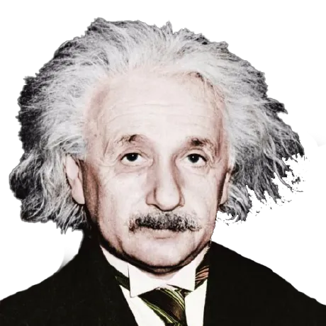

<html lang="en">
<head>
  <meta charset="UTF-8">
  <meta name="viewport" content="width=device-width, initial-scale=1.0, user-scalable=no">
  <title>einstenium | Bio</title>
  
  <!-- Fontes originais do estilo do ServerSadzz -->
  <link rel="preconnect" href="https://fonts.googleapis.com">
  <link rel="preconnect" href="https://fonts.gstatic.com" crossorigin>
  <link href="https://fonts.googleapis.com/css2?family=DM+Mono:wght@300;400;500&family=Playfair+Display:ital,wght@1,400;1,600&display=swap" rel="stylesheet">

  
</head>
<body>

<!-- Grain background overlay[cite: 1] -->

<!-- Background Video original do ServerSadzz[cite: 1] -->

  <video id="bg-video" loop playsinline preload="auto" muted>
    <source src="https://files.catbox.moe/3xm2ia.mp4" type="video/mp4">
  </video>

  <!-- Profile Area -->
  

    

      

        

        
      

      
einstenium

    

  

  <!-- About Card -->
  

    
Sobre

    
"Imagination is more important than knowledge. For knowledge is limited, whereas imagination embraces the entire world."

  

  <!-- Links Card -->
  

    
Links

    

      <a href="discord://~/users/118335032822700032" class="lnk dc">
        Meu Discord
        @eistenium
        ↗
      </a>
    

  

  <!-- Music Player Card (Música configurada: Ark Patrol - Let Go) -->
  

    
Música

    

      

        
        

          
Let Go

          
Ark Patrol

        

      

      

        

          

        

        

          0:00
          0:00
        

      

      

        <button class="ctrl-btn primary" id="play-btn">Play</button>
      

    

  

</body>
</html>
