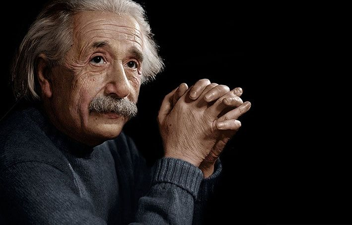

<html lang="pt-BR">
<head>
  <meta charset="UTF-8">
  <meta name="viewport" content="width=device-width, initial-scale=1.0, user-scalable=no">
  <title>einstenium | Bio</title>
  
  <!-- Fontes Gringas Minimalistas -->
  <link rel="preconnect" href="https://fonts.googleapis.com">
  <link rel="preconnect" href="https://fonts.gstatic.com" crossorigin>
  <link href="https://fonts.googleapis.com/css2?family=DM+Mono:wght@300;400;500&family=Playfair+Display:ital,wght@1,400;1,600&display=swap" rel="stylesheet">

  
</head>
<body>

<!-- Tela de Entrada Animada -->

  

<!-- Efeito de grão discreto -->

<!-- Conteúdo Principal -->

  <!-- Banner Corrigido -->
  

    
  

  
einstenium

  <!-- Frase -->
  

    
Pensamento

    
"Procure ser uma pessoa de valor, em vez de procurar ser uma pessoa de sucesso."

  

  <!-- Links -->
  

    
Conectar

    <a href="discord://~/users/118335032822700032" class="lnk">
      Discord
      @eistenium
      ↗
    </a>
  

</body>
</html>
